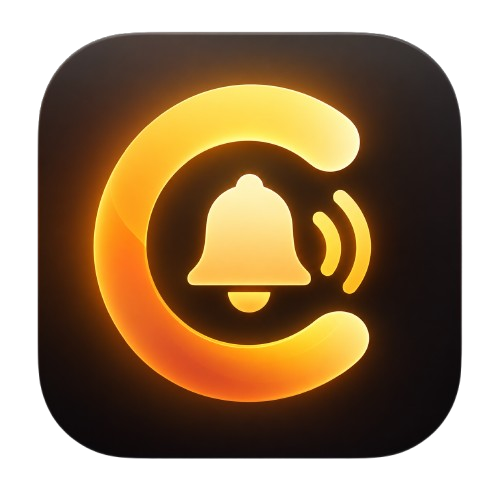

<div align="center">



# 🍛 Curry

### ✨ A modern notification companion for Windows

<p align="center">
  <strong>Capture notifications. Visualize them with ambient screen-edge glow. Keep your history organized.</strong>
</p>

> *Curry is a polished Windows desktop notification companion built around native notifications, ambient glow, and a privacy-first local architecture.*

<p align="center">
  <a href="https://github.com/owergungor/Curry"></a>
  
  <a href="https://www.rust-lang.org/"></a>
  <a href="https://v2.tauri.app/"></a>
  <a href="https://svelte.dev/"></a>
  <a href="https://www.typescriptlang.org/"></a>
</p>
<p align="center">
  
  
  <a href="LICENSE"></a>
</p>

</div>

---

## 📚 Contents

- [✨ Overview](#-overview)
- [✨ Why Curry?](#-why-curry)
- [🖥️ Screenshots](#️-screenshots)
- [🔔 Notifications](#-notifications)
- [✨ Ambient Glow Engine (5 Animation Styles)](#-ambient-glow-engine-5-animation-styles)
- [📱 Application Profiles](#-application-profiles)
- [🎮 Fullscreen & Gaming Suppression](#-fullscreen--gaming-suppression)
- [🖥️ OLED Mode Optimization](#️-oled-mode-optimization)
- [🎨 Themes](#-themes)
- [🪟 Windows Integration & Supported Platforms](#-windows-integration--supported-platforms)
- [🔒 Privacy First](#-privacy-first)
- [🏗️ Architecture](#️-architecture)
- [⚡ Tech Stack](#-tech-stack)
- [💾 Storage & Persistence](#-storage--persistence)
- [🔄 Legacy Migration](#-legacy-migration)
- [📦 Installation](#-installation)
- [🛠️ Development](#️-development)
- [🧪 Testing](#-testing)
- [🗂️ Project Structure](#️-project-structure)
- [🤝 Contributing](#-contributing)
- [📜 License](#-license)

---

## ✨ Overview

Windows notifications frequently slip into the Action Center unnoticed while you are immersed in focus mode, coding, full-screen gaming, or media playback.

**Curry** solves this with an ambient, hardware-accelerated desktop utility built with **Rust**, **Tauri 2**, and **Svelte 5**. It detects incoming Windows desktop notifications in real-time, illuminates your display borders with 5 customizable screen-edge glow animations, applies per-application custom glow profiles, suppresses distracting overlays while gaming or in fullscreen mode, maintains a searchable history feed, and runs entirely on your local machine with **zero telemetry**.

---

## ✨ Why Curry?

| | Feature | Description |
|:---:|---|---|
| 🔔 | **Notification Capture** | Native WinRT capture for incoming Windows desktop toast notifications |
| 🌈 | **5 Ambient Animations** | GPU-accelerated edge illumination: Pulse, Sweep, Ambient, Comet, and Ripple |
| 📱 | **Application Profiles** | Per-app custom colors, animations, intensities, durations, and fullscreen rules |
| 🎮 | **Gaming Suppression** | Native Win32 fullscreen detection to prevent glow disruptions during full-screen games |
| 🛡️ | **OLED Optimization** | Peak intensity limiting and tighter spread to save power and prevent panel burn-in |
| 🎨 | **Curated Themes** | 7 handcrafted dark-mode and aesthetic color palettes |
| 📜 | **Searchable History** | In-memory ring buffer with full-text search, app filtering, and read/unread states |
| 🔒 | **100% Private** | Completely offline architecture; notifications and settings never leave your machine |
| ⚡ | **Lightweight & Fast** | Native Rust backend with WebView2 frontend footprint and 0% idle CPU usage |
| 🪟 | **Windows Native** | System tray minimization, silent autostart, and single-instance mutex protection |

---

## 🖥️ Screenshots

<div align="center">

### 📊 Dashboard
> 


### 🔔 Notification History
> 


### ✨ Ambient Glow & Application Profiles
>  


### 🎨 Themes
>  


</div>

---

## 🔔 Notifications

Curry integrates with the official modern Windows notification pipeline:

- **WinRT Integration**: Accesses desktop notifications via `Windows.UI.Notifications.Management.UserNotificationListener` without requiring administrator privileges.
- **Intelligent Deduplication**: Bounded cache with a 15-minute TTL and SHA content fingerprinting prevents duplicate entries from repeated app toasts.
- **Full-Text Search**: Instantly query notification titles, message bodies, and source application names.
- **Read & Unread State**: Mark individual notifications as read/unread or clear the feed with one click.
- **Safe Persistence**: Bounded ring buffer persists up to 1,000 notifications locally across application reboots.

---

## ✨ Ambient Glow Engine (5 Animation Styles)

The ambient glow engine displays a transparent, always-on-top, click-through overlay around your display borders whenever a notification arrives.

### 🎬 5 Core Animation Styles

| Style | Visual | Behavior | Recommended For |
|---|:---:|---|---|
| **Pulse** | ⚡ | Rhythmic pulse with soft intensity modulation | Urgent glanceable alerts |
| **Sweep** | 🌊 | Dynamic, continuous perimeter border light travel | Smooth ambient transitions |
| **Ambient** | 🌬️ | Low-frequency, organic harmonic border illumination | Subtle background awareness |
| **Comet** | ☄️ | Focused bright travelling segment with a graceful fading trail | Distinct high-energy cues |
| **Ripple** | 💫 | Expanding luminous wave radiating outward across screen edges | Expressive notifications |

*(Legacy configurations with `breathing` or `solid` are seamlessly and safely migrated to `Ambient` without crashes).*

### 🎛️ Configurable Controls

| Setting | Options / Range | Description |
|---|---|---|
| **Animation Style** | `Pulse` / `Sweep` / `Ambient` / `Comet` / `Ripple` | Visual animation timing and motion dynamic |
| **Border Thickness** | `2px` to `32px` | Visual width of the screen-border glow |
| **Glow Duration** | `500ms` to `10,000ms` | Total active display duration |
| **Peak Opacity** | `10%` to `100%` | Peak luminosity scaling |
| **Target Monitor** | `Primary` / `Active Window` / `All Displays` | Display coordinate routing for the overlay window |
| **Color Palette** | Theme Swatches or Custom HEX | Theme-matched accents or personalized colors |
| **Window Interaction** | `WS_EX_TRANSPARENT` | True click-through overlay; never steals mouse or keyboard focus |

---

## 📱 Application Profiles

Curry supports **per-application glow customization**:

- **Native Windows File Picker (`.exe`)**: Convenient **Browse...** button opens the standard Windows Open File Dialog filtering for `.exe` executables, automatically extracting the application display name, executable name, and full path.
- **Duplicate Protection**: Case-insensitive executable validation prevents duplicate profiles for the same application (e.g., `Discord.exe` vs `discord.exe`).
- **Full Path Tracking**: Optional executable path tracking (`executablePath`) with 100% backward compatibility for existing profile configurations.
- **Per-App Overrides**: Configure dedicated colors, animations, intensities, durations, monitor targets, and fullscreen behaviors for applications like Discord, Spotify, Steam, VS Code, and more.
- **Nullable Fallbacks**: Any unset profile field automatically inherits the global ambient settings.
- **Case-Insensitive Resolution**: Accurately matches applications by window title, friendly app name, or executable name (e.g. `Discord.exe` or `discord`).
- **Live Preview**: Test application-specific illumination in real-time directly from the Applications management tab without firing real notifications.

---

## 🎮 Fullscreen & Gaming Suppression

Curry features intelligent fullscreen detection powered by native Win32 APIs (`GetForegroundWindow`, `GetWindowRect`, and `GetMonitorInfoW`):

- **Always Show**: Overlay renders over all desktop windows, including games.
- **Suppress in Fullscreen**: Silences ambient glow when any application or game is running in true fullscreen mode.
- **Suppress Gaming**: Automatically protects gaming sessions from visual interruptions.
- **Per-App Overrides**: Granularly override fullscreen behavior for specific apps (e.g. suppress games while allowing urgent team chat alerts).

---

## 🖥️ OLED Mode Optimization

Built for modern OLED and Mini-LED monitors:

- **Luminosity Capping**: Caps maximum glow intensity to 60% peak brightness.
- **Reduced Spread**: Halves border thickness and box-shadow diffusion to minimize illuminated pixel surface.
- **Duration Limiting**: Caps sustained illumination to a maximum of 2,000ms.
- **Burn-In Protection**: Lowers panel stress and reduces power consumption.

---

## 🎨 Themes

Curry includes **7 curated themes**. **Perpetuity** is the canonical default theme.

| Theme | Style | Default | Primary Swatches |
|---|---|:---:|---|
| **🪐 Perpetuity** | Obsidian slate & futuristic cyan-indigo glow | ✅ | `#0b0f19` `#121826` `#6366f1` `#38bdf8` |
| **🐱 Catppuccin** | Soothing pastel Mocha with mauve & blue accents | | `#1e1e2e` `#181825` `#cba6f7` `#89b4fa` |
| **📜 Vintage Paper** | Warm sepia & muted parchment for low eye strain | | `#181614` `#221f1c` `#d4a373` `#e09f67` |
| **💜 Amethyst Haze** | Deep midnight violet & luminous neon purple glow | | `#0e0b16` `#161224` `#a855f7` `#ec4899` |
| **🌿 Sage Mist** | Calming eucalyptus slate with mint & emerald accents | | `#0d1412` `#131d1a` `#10b981` `#34d399` |
| **🩷 Bubblegum** | High-energy retro cyberpunk pink & electric cyan | | `#120914` `#1a0f1d` `#f43f5e` `#06b6d4` |
| **🟠 Amberstate** | Industrial dark charcoal with warm amber glow | | `#14120e` `#1c1914` `#f59e0b` `#fbbf24` |

---

## 🪟 Supported Platforms & Windows Integration

### Supported Platforms
- ✅ **Windows 11**: Fully supported (All editions)
- ✅ **Windows 10**: Fully supported (Version 1607+ / Build 14393+)
- 🗺️ **macOS**: *On Roadmap* (Planned for future release via macOS UserNotifications framework)
- 🗺️ **Linux**: *On Roadmap* (Planned for future release via FreeDesktop / D-Bus Notification specification)

### Windows Deep Integration
- **WinRT Toast Capture**: Accesses native desktop notifications using `Windows.UI.Notifications.Management.UserNotificationListener`.
- **Win32 Fullscreen Query**: High-frequency geometric matching against foreground window bounds and display geometry.
- **System Tray Lifecycle**: Closing the window hides Curry to the tray (`tauri::tray::TrayIcon`); double-clicking or selecting **Open Curry** restores and focuses the window.
- **Silent Autostart**: Queries and writes to `HKCU\Software\Microsoft\Windows\CurrentVersion\Run` with `reg.exe` using `CREATE_NO_WINDOW` (`0x08000000`) to guarantee zero console flashes on system startup.
- **Desktop Window Experience**: True desktop settings application window (default 1152x768, minimum 900x600, centered) with native minimize, maximize, and resize controls; strictly separated from the transparent, borderless screen-edge glow overlay windows.
- **Single-Instance Protection**: Enforced by the Win32 named system mutex `Global\Curry`. Launching a second instance automatically focuses the existing window and terminates the duplicate process.

---

## 🔒 Privacy First

> **Curry is designed to work entirely on your machine.**

Notification text often contains sensitive communications, authentication codes, or personal messages. Curry ensures your data remains strictly private:

- ✅ **No telemetry** — Zero tracking tokens, telemetry beacons, or usage analytics.
- ✅ **No analytics** — No diagnostic crash uploads or event logging to external servers.
- ✅ **No external notification servers** — Listens directly to the Windows Action Center locally.
- ✅ **No cloud dependency** — Operates 100% offline without requiring internet access.
- ✅ **Local notification history** — Stored exclusively in `%APPDATA%\com.curry.app\notifications.json`.
- ✅ **Local settings** — Preferences remain on your drive in `%APPDATA%\com.curry.app\settings.json`.
- ✅ **Strict Content Security Policy** — Tauri CSP restricts network communication to local IPC only (`connect-src ipc: http://ipc.localhost`).

---

## 🏗️ Architecture

```text
┌─────────────────────────────────────────────────────────────┐
│                          Curry UI                           │
│                   Svelte 5 + TypeScript                     │
│        (Dashboard · Feed · Theme Engine · Settings)         │
└──────────────────────────────┬──────────────────────────────┘
                               │
                               ▼
┌─────────────────────────────────────────────────────────────┐
│                      Tauri 2 IPC Bridge                     │
│         (Typed Commands · Events · Window Management)       │
└──────────────────────────────┬──────────────────────────────┘
                               │
                               ▼
┌─────────────────────────────────────────────────────────────┐
│                         Rust Backend                        │
│         ├── AppState Gatekeeper (Active / Paused)           │
│         ├── Deduplication Engine (15-min TTL Cache)         │
│         ├── Win32 Named Mutex (Global\Curry)                │
│         ├── System Tray Service                             │
│         └── Glow Window Overlay Manager                     │
└───────────────┬─────────────────────────────┬───────────────┘
                │                             │
                ▼                             ▼
   ┌───────────────────────────┐ ┌───────────────────────────┐
   │        Windows APIs       │ │       Local Storage       │
   │  - WinRT Notification     │ │  - Atomic Writes (.tmp)   │
   │    Listener (0.62)        │ │  - %APPDATA%\com.curry.app│
   │  - HKCU Autostart Reg     │ │  - Settings & History     │
   └───────────────────────────┘ └───────────────────────────┘
```

---

## ⚡ Tech Stack

| Technology | Layer | Purpose |
|---|---|---|
| **[Rust](https://www.rust-lang.org/)** `1.85+` | Native Backend | High-performance threading, Win32 interop, deduplication & atomic storage |
| **[Tauri 2](https://v2.tauri.app/)** | Desktop Runtime | Secure WebView2 host with ultra-low memory overhead |
| **[Svelte 5](https://svelte.dev/)** | Frontend UI | Next-gen reactive dashboard, virtualized feed, and CSS theme system |
| **[TypeScript](https://www.typescriptlang.org/)** `5.6` | Typing | End-to-end type safety for notification models, themes, and IPC payloads |
| **[Vite 6](https://vitejs.dev/)** | Frontend Tooling | Lightning-fast development HMR and static asset bundling |
| **[WinRT APIs](https://learn.microsoft.com/en-us/uwp/api/)** | OS Hook | `Windows.UI.Notifications.Management` via the `windows` crate (`0.62`) |

---

## 💾 Storage & Persistence

Curry keeps all persistent configuration in `%APPDATA%\com.curry.app\`:

- `settings.json`: General preferences (autostart toggle, sound alert, urgency thresholds).
- `glow_settings.json`: Glow animation style, duration, thickness, and monitor configuration.
- `notifications.json`: Historical notification ring buffer.

**Atomic File Writes**: Files are written to a `.tmp` file and committed via atomic rename (`std::fs::rename`), eliminating the risk of corrupted settings during sudden power loss.

---

## 🔄 Legacy Migration

For users upgrading from previous NotiGlow installations, Curry includes an automatic, non-destructive migration system:

1. **Automatic Detection**: On launch, Curry scans for legacy data in `%APPDATA%\com.notiglow.app`, `%APPDATA%\notiglow`, and `%APPDATA%\com.curry.desktop`.
2. **JSON Validation**: Files are parsed and validated prior to transfer to prevent importing corrupt data.
3. **Non-Destructive Copy**: Valid data is safely transferred to `%APPDATA%\com.curry.app` without altering or deleting the original legacy files.
4. **Registry Cleanup**: Removes legacy startup entries and registers `Curry` in `HKCU\...\Run`.
5. **Dual Mutex Co-locking**: Concurrently acquires `Global\Curry` while locking `Global\NotiGlow` to prevent legacy and new instances from running at the same time.

---

## 📦 Installation

### Production Packages
Production packages for Windows x64:

- **Release Archive**: `Curry_1.1_win-x64.zip` (Standalone portable production binary)
- **Official GitHub Releases**: [github.com/owergungor/Curry/releases](https://github.com/owergungor/Curry/releases)

Download `Curry_1.1_win-x64.zip`, extract it to your preferred location, and launch `curry.exe`. All application settings and profiles will be automatically created in `%APPDATA%\com.curry.app\`.

---

## 🛠️ Development

### Prerequisites
- **[Node.js](https://nodejs.org/)**: `v20.x` or later
- **[Rust](https://rustup.rs/)**: `v1.85.0` or later (`x86_64-pc-windows-msvc`)
- **[Visual Studio Build Tools](https://visualstudio.microsoft.com/visual-cpp-build-tools/)**: "Desktop development with C++" workload
- **[WebView2](https://developer.microsoft.com/en-us/microsoft-edge/webview2/)**: Included on Windows 10 & 11

### Setup Commands

```bash
# 1. Clone the repository
git clone https://github.com/owergungor/Curry.git
cd Curry

# 2. Install Node.js dependencies
npm install

# 3. Start the development server with Tauri HMR
npm run tauri dev
```

---

## 🧪 Testing

Curry maintains a rigorous automated testing suite:

```bash
# Frontend Svelte and TypeScript diagnostic checks
npm run check

# Rust automated unit & integration test suite (70 tests)
cd src-tauri
cargo test
cd ..
```

**Automated Test Suite Status**: **70 passed, 0 failed, 0 warnings**.<br />
Covers notification deduplication TTL, atomic storage recovery, state synchronization, startup registry commands, single-instance mutex conflicts, theme schema validation, application profile resolution, legacy animation migration, OLED intensity limiting, and Win32 fullscreen suppression.

---

## 🔧 Troubleshooting

### 1. Notifications Not Triggering Glow
- **Check Windows Notification Permissions**: Open **Windows Settings → System → Notifications** and ensure notifications are enabled globally and for your target applications.
- **Focus Assist / Do Not Disturb**: If Windows Focus Assist / Do Not Disturb is enabled, incoming toast notifications are silenced by the OS and will not trigger real-time ambient illumination.
- **Verify Curry Enabled State**: Ensure the top toggle in the Curry Dashboard is in the **Active** state.

### 2. Glow Suppressed While Gaming / Fullscreen
- **Check Fullscreen Behavior**: Open **Glow Settings** and review the **Fullscreen Behavior** selector.
  - If set to `Suppress in Fullscreen` or `Suppress Gaming Only`, edge glow will be suppressed whenever a foreground application covers your entire screen resolution.
  - Set to `Always Show` if you want edge illumination to appear over fullscreen games and video players.
- **Application Profile Overrides**: Check the **Applications** tab to ensure the active profile does not have `Suppress in Fullscreen` explicitly enabled.

### 3. Application Profile Not Matching
- Process names can be specified with or without `.exe` (e.g., `Discord` or `Discord.exe`). Matching is case-insensitive.
- Check the notification feed in Curry's **History** tab to see the exact application source name detected by Windows.

### 4. Display Positioning on Multi-Monitor Setups
- By default, Curry renders on the **Primary Monitor**.
- To change this, select `All Monitors` or configure a per-application monitor preference under the **Applications** tab.

## 🗂️ Project Structure

```text
Curry/
├── src/                          # Svelte 5 + TypeScript frontend
│   ├── lib/
│   │   └── themes.ts             # 7 theme definitions and color tokens
│   ├── routes/
│   │   ├── glow/
│   │   │   └── +page.svelte      # Transparent screen-edge glow overlay window
│   │   ├── +layout.ts            # SvelteKit SPA prerender configuration
│   │   └── +page.svelte          # Main Curry dashboard, feed & settings
│   └── app.html                  # HTML entry point
├── src-tauri/                    # Rust native application backend
│   ├── capabilities/
│   │   └── default.json          # Tauri 2 security capabilities
│   ├── icons/                    # Multi-resolution application icons
│   ├── src/
│   │   ├── glow/                 # Glow manager, animation models & storage
│   │   ├── notification/         # Notification engine, WinRT listener & storage
│   │   ├── settings/             # Settings state, startup manager & storage
│   │   ├── lib.rs                # Tauri command registry & migration routines
│   │   ├── main.rs               # Application entry point & 43 unit tests
│   │   ├── single_instance.rs    # Win32 named system mutex implementation
│   │   ├── state.rs              # Thread-safe global application state
│   │   └── tray.rs               # System tray icon & context menu
│   ├── Cargo.toml                # Rust crate metadata & dependencies
│   ├── Cargo.lock                # Deterministic dependency lockfile
│   ├── build.rs                  # Tauri build hook
│   └── tauri.conf.json           # Tauri window, security & bundle configuration
├── static/                       # Static public assets (icons, SVGs)
├── .gitignore                    # Git exclusions for build artifacts & caches
├── LICENSE                       # MIT License
├── package.json                  # NPM project metadata & build scripts
├── package-lock.json             # NPM lockfile
├── svelte.config.js              # SvelteKit static adapter configuration
├── tsconfig.json                 # TypeScript compiler configuration
├── vite.config.js                # Vite bundler configuration
└── README.md                     # Project documentation
```

---

## 🤝 Contributing

Contributions, bug reports, and feature suggestions are welcome!

1. Fork the repository.
2. Create a feature branch (`git checkout -b feature/my-feature`).
3. Verify all tests pass (`npm run check` and `cargo test`).
4. Commit your changes (`git commit -m "feat: add my feature"`).
5. Push your branch (`git push origin feature/my-feature`).
6. Open a Pull Request.

*Please ensure any proposed contributions maintain Curry's 100% local, offline privacy architecture.*

---

## 📜 License

This project is licensed under the **MIT License** — see the [LICENSE](LICENSE) file for details.

---

<div align="center">

Built with 🦀 <strong>Rust</strong>, ⚡ <strong>Tauri</strong> and 🧡 <strong>Svelte</strong>

**🍛 Curry** — Modern Windows Desktop Notification Companion

</div>
